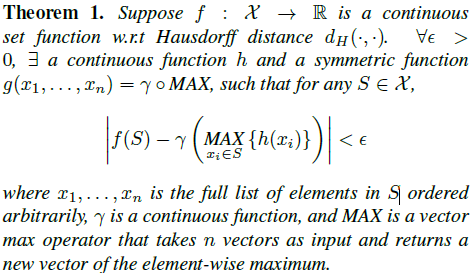

## PointNet: Deep Learning on Point Sets for 3D Classification and Segmentation

Charles R. Qi et al. CVPR 2017

#### **Abstract**

PC(irregular) transformation to regular format(image grids or 3D voxels) renders data unnecessarily voluminous and cause issues.  
In this paper, novel NN that directly consumes PC which respects the permutation invariance(치환 불변) of points is designed.  
PointNet directly takes point clouds as input with three coordinates(x, y, z) and provides object classification, part segmentation, scene semantic parsing.  

### **1. Introduction**

Novel deep net architecture suitable for consuming unordered point sets in 3D;  
Show how such a net can be trained to perform 3D shape classification, shape part segmentation and scene semantic parsing tasks;  
Provide thorough empirical and theoretical analysis on the stability and efficiency.  
Illustrate the 3D features computed by the selected neurons in the net and develop intuitive explanations for its performance.  

### **2. Related Work**

PC Features: handcrafted towards specific tasks. intrinsic or extrinsic, local or global features. not trivial to find the optimal feature combination.  
DL on 3D Data:  
- Volumetric CNNs(3D conv NN on voxelized shapes, volumetric representation is constrained by its resolution due to sparsity and computation cost)  
- Multiview CNNs(render 3D PC to 2D images, nontrivial to extent them to scene understanding, point classification or shape completion)  
- Spectral CNNs(constrained on manifold meshes such as organic objects, not obvious how to extend them to non-isometric shapes such as furniture)  
- Feature-based DNNs(convert 3D data into a vector, extract traditional shape features, constrained by the representation power)  
DL on Unordered Sets: PC is an unordered set of vectors. Most works in DL focus on regular input(images, video or 3D data) not on point sets.  

### **3. Problem Statement**

PC is represented as a set of 3D points P_i coordinate(x, y, z) plus extra features(color, normal etc). PointNet only used (x, y, z) coordinates.  
Object Classification & Semantic Segmentation.  

### **4. DL on Point Sets**

#### 4.1 Properties of Point Sets in R^n

Unordered, interation among points(not isolated, combinatorial interactions), invariance under transformations(rotation, translation)  

#### 4.2 PointNet Architecture

Three key modules: max pooling layer(as a symmetric function to aggregate information from all points), local and global information combination structure, two joint alignment networks(align both input points and point features)  

* Symmetry Function for Unordered Input: (to make model invariant to input permutation) sort input into canonical order, treat input as a sequence to train an RNN, use simple symmetric function to aggregate the info from each point. Sorting X(MLP with sorted input is slightly better than MLP without sorting but both poor). RNN X (randomly permuted sequential signal, hard to scale thousands of input elements). --> apply symmetric function (1) f(x1, x2, ..., xn) ~= g(h(x1), ..., h(xn)) h(MLP) g(single variable func and max pooling func) ==> output is vector [f1, ..., fk], global signature of the input set.  

* Local and Global Information Aggregation: Train SVM or MLP classifier global features. Feed global feature back to per point features by concatenating the global feature with each of the point features(nx1088 = {nx64, nx1024}). --> extract new per point features(aware of both local and global info, nx128) based on the combined point features(segmentation network).  

* Joint Alignment Network: Semantic labeling has to be invariant to geometric transformations. Expect that the learnt representation by point set is invariant to transformations. Natural solution is to align all input set to a canonical space before feature extraction. Apply input coordinates directly to an affine transformation matrix(T-Net) composed by basic modules of point independent feature extraction, max pooling and fully connected layers. To prevent increasing difficulty of optimization due to higher dimension, it added a regularization term to its softmax training loss. It constrain the feature transformation matrix to be close to orthogonal matrix(will not lose information):  

  

#### 4.3 Theoretical Analysis

* Universal approximation: By the continuity of set functions, intuitively, a small perturbation to the input point set should not greatly change the function values, such as classification or segmentation scores.  

  

* Bottleneck dimension and stability: Small corruptions or extra noise points in the input set are not likely to change the output of our network.  

  
(a) says that f(S) is unchanged up to the input corruption if all points in Cs are preserved and also unchanged with extra noise points up to Ns. (b) says that Cs only contains a bounded number of points, determined by a finite subset Cs(critical point set of S) of less or equal to K(bottleneck dimension of f) elements.

### **5. Experiment**

<!--
#### 5.1 Applications

#### 5.2 Architecture Design Analysis

#### 5.3 Visualizing PointNet

#### 5.4 Time and Space Complexity Analysis
-->
### **6. Conclusion**

Paper propose a novel DNN PointNet that directly consumes point cloud and provides 3D recognition tasks including classification, part segmentation and semantic segmentation while obtaining on par or better results than state of the arts.

<!--
#### **Studies**
[PointNet](https://github.com/blu-y/note/tree/main/Studies/PointNet/)

[NeRF](https://github.com/blu-y/note/tree/main/Studies/NeRF/)
-->

### Demo (PointNet++)  

  